# Specialization (Q3 2015-2016) report - Steff Kempink
###### Based on the game a week concept

## Abstract  
In this article I will report on the work, insights and results of 8 weekly experimental projects I made. By researching a select amount of AI, physics and procedural generation techniques and applying them in my work I gained a lot of experience in little time.
All the results are stored in a public Github repository.

## Introduction
Like any creative endeavor, a great video game is both a great idea and a great execution. Ideas can be found virtually anywhere. Execution however depends on a combination of skill and experience. Both are primarily gained through diligent practice. For this reason, it can be a great boon for anybody wanting to increase their game making proficiency to work on projects with the singular goal of gaining new insights through work. 
The goal of keeping a log of the work I'm doing is to analyze the thought process and through a critical look increase the benefits from these experiments.

## Workflow
I started by reading/researching different concepts through articles, papers and presentations. From this pool of information I chose a concept I wanted to work with more.
Using Unity I would build a working implementation, researching more only when I got stuck. After this was running I would couple it with a crude game concept, just something to give context for any further work.


## Week 00 - Preparations
This was the inception phase of the project. Here I decided on the subject for my Specialization. This included defining my scope and motivating the merits of this workflow.
I also set up my working environment. I decided to host the project in an open Github repository. Unity as a platform was an easy decision as I had a lot of previous experience with this engine. I wanted to gather some utility libraries I anticipated I would need. I limited myself to free and open source assets.

* [DebugDrawingExtension](https://www.assetstore.unity3d.com/en/#!/content/11396)
Extends Unity's build-in debug line drawing to easily draw primitives wire spheres, boxes and arrows. Every time I used this I got to appreciate the value of visual debugging more.
* [DOTween](https://www.assetstore.unity3d.com/en/#!/content/27676)  
A tweening library. It always pays to add extra flair to objects my having them animate all the time. Although I didn't end up putting a lot of polish into the experiments, it's always good to have this sort of library at your fingertips.
* [GradientMaker](https://www.assetstore.unity3d.com/en/#!/content/29252)
I nice little editor extension that let's you generates gradient textures from within the editor. Very useful for tweaking effects.
* [Lunar Mobile Console](https://www.assetstore.unity3d.com/en/#!/content/43800)
A development utility that let's you view debug logs on a mobile device.

## Week 01
Because I had noticed how unfamiliar I had become with C#, I decided to closely follow some Catlike Coding articles to get back up to speed. This got me back into the right mindset. And made me run headfirst into my what I would focus on this week; pseudorandom noise.

Pseudorandom noise functions are extremely common in computer graphics. They can be used as a base for procedural effects, terrains and animations. Pseudorandom noise has the nice property of yielding varied results, but slightly predictable as compared to pure random noise.

The most well known one is Perlin noise, which when generated in 2D looks a bit like clouds.


A simple use case of this data is to let it drive the height and color of a mesh, which produces this  very rudimentary terrain:

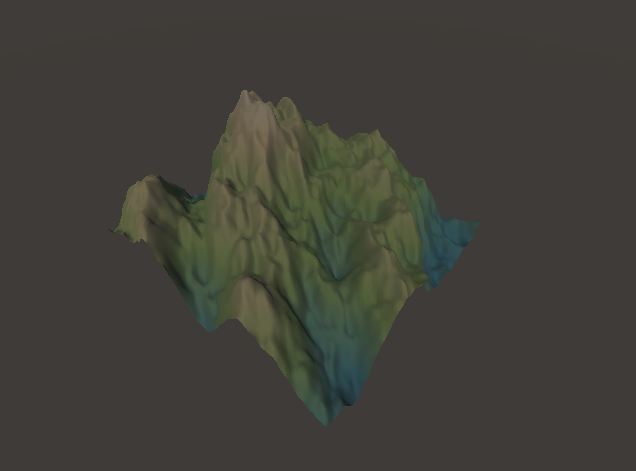

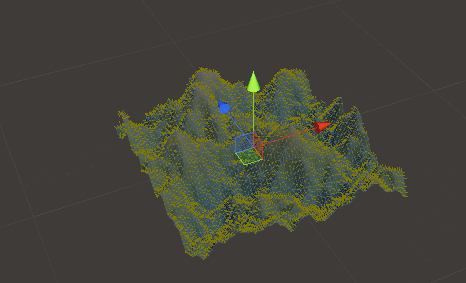


This is an example of a 2D noise function. For most noise functions, there exist no theoretical cap for up to how many dimensions they go, but most libraries stick to 1, 2, 3, 4 and 6 dimensional noise. Following [this article](http://web.archive.org/web/20160318140201/http://catlikecoding.com/unity/tutorials/noise/), I only implemented 1, 2 and 3 dimensional Value and Perlin noise for my purposes.

I had the idea to use 3D Perlin noise to create a space nebula you can fly through. But a good looking volume of scattered points requires more than just the noise function. Because I would be using billboarded particles, I couldn't just place one at every n'th  point because the grid would be too obvious. Just randomly offsetting the points also doesn't work, [as this article illustrates](http://web.archive.org/web/20141222220009/http://www.gamasutra.com/view/feature/1648/random_scattering_creating_.php?print=1):

While I was researching procedural content generation, I had read [an article by Herman Tullleken that described how Poisson Disk sampling worked](http://web.archive.org/web/20160330213235/http://devmag.org.za/2009/05/03/poisson-disk-sampling/). The algorithm essentially starts at a random point, then creates "x" amount of new points around itself based on a minimum and maximum distance. Then it discards points that are too close to already existing points and repeats these steps until the area/volume is all filled up. If you want to read exactly how I strongly recommend the article.

In its conclusion, Tulleken mentions how driving the minimum distance of the algorithm by a noise function instead of constant values can yield very nice results. This was the part that I remembered as I began on my nebula.

I started a mock implementation of the algorithm, but then I saw how the article linked to a freely distributed C# 2D implementation of Poisson Disk sampling. To save time, I took [this implementation by Renaud Bédard](http://theinstructionlimit.com/fast-uniform-poisson-disk-sampling-in-c) and converted it to 3D instead of writing it from scratch.

Having the base logic already be implemented saves a lot time. However it still took me longer than expected to convert it to 3D and then debug the ensuing issues that came with this. The algorithm also ate up memory as the 3D version of finding a random surrounding point scaled exponentially compared to the 2D version. This made me want to pay closer attention to potential hotspots in the code.
Using Unity's build-in profiler and logging the raw time in some small test code I found it is much better to substitute all calls to Unity's Mathf library with my own. Statistics showed that calling overhead on distance and lerp functions was reduced by 80%.
So finally I made the Min and Max Distance of the Poisson Disc sample from the 3D noise. I then spawned particles on these coordinates,  basing their color and lifetime on the same noise values. Iterating through the resulting array nicely shows how Poisson Disk sampling finds points in space:


However, this ripple effect looks very artificial, especially as the particle field starts looping. So after shuffling the resulting points this is the end result:

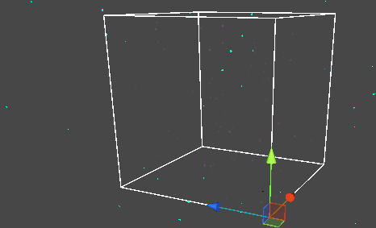

On the last day I added a simple spaceship. I quickly threw together some basic controls and exhaust effects. I had tried making a "chunk" system that was supposed to help me spawn new segments as the player moved, but it didn't solve the real issue of many of the 3D calculations being prohibitively slow. So I had to box the spaceship inside a very large cube with *invisible* colliders and a complete admission of defeat.


### Lessons Learned
Finding a good implementation reference for a single noise function had multiple effects. Not only was I able to move beyond only theoretical understanding of the workings of Perlin noise. But this also provided a good foundation for reasoning about other types of noise in the future as well.

I also learned the effects of moving algorithms from 2 to 3 dimensions. Even though it is simple to extend some cheap and efficient algorithms that work well in 2 dimensions into 3 dimensions, their execution can become exponentially more expensive. For my use case, this caused a loss of flexibility.

## Week 02
The previous week had yielded something with a very minimal amount of interaction. I started out this week with the goal by planning more gameplay. I wanted to base the game on physics which in retrospect would clearly trip me up.

The concept was to combine the gameplay from minigolf games with action movies where the hero dodges bullets jumping from desk to desk. Based on previous knowledge I knew I couldn't just twiddle with values and derive the movement values from my intent.
* http://gafferongames.com/game-physics/
* http://www.gdcvault.com/play/1023559/Math-for-Game-Programmers-Building

So after reading multiple articles I created the movement controls. The player looks like a capsule, but all movement is actually based on a freely gyrating ball. I worked on the input until I could predictably add the correct amount of force for the ball to roll based on exactly how far I wanted it to be able to move.
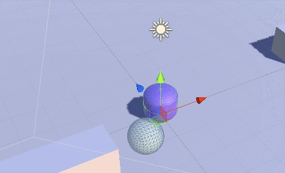

However the controls didn't feel satisfying so I spun my wheels trying several different input schemes. These results couldn't satisfy me either, so I decided to jump over to work on another part; the shooting and avoiding. This was all very straightforward.

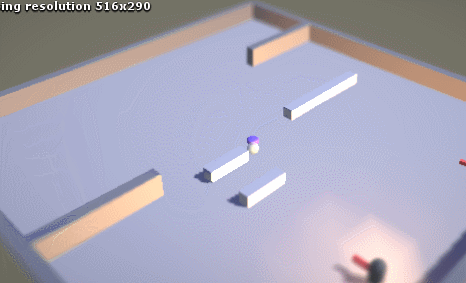

I should've known better than to make a physics based game before I had a good grip on the mathematics involved. In the end I had to give up on getting the game to work well. I instead doubled down on research so that I would have a better shot at understanding all the requirements the next time something like this would come up.

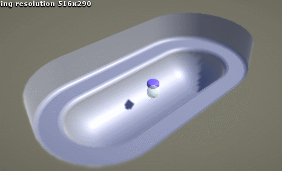

In order to take my mind off physics I spend the last day on miscellaneous bits and pieces. I read up on the Yarn dialogue engine. I added its interpreter to my Unity project, which was designed to not require the user to learn how the Yarn interpreter even worked. However, as learning exercise I then cracked open the code to see how its developers solved some common problems in dialogue systems. I mostly found very straightforward solutions with only few super elegant structures.

https://github.com/InfiniteAmmoInc/Yarn

### Lessons Learned
I gained a much better understanding of the internals of a physics engine. However I made the mistake to think I had learned enough to even base a simple physics game on them. Because I had not internalized the formulas enough, I could not be flexible enough with the game. Every change I wanted to make to the balls behavior led me to read more about physics first. This slowdown killed the experimental flow for me.

## Week 03
My objective this week was to start applying some of the lessons I learned last week. Because during the previous week I had found that my experience with physics was totally lacking, I just wanted to dive in and toy with formulas this time around.

I started by implementing spring physics on top of Unity's Physx rigid bodies and colliders. Using the formulas I found in [this article](http://gafferongames.com/game-physics/spring-physics/) as a base, I was off to a pretty good start.

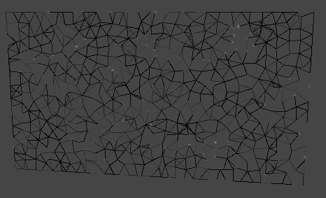

It was interesting to play with different rules for when springs would be created/destroyed between points and the effects they had on the motion of the swarm as a whole. In the above animation the points will occasionally start looking for close neighbors, expanding the search range if the amount of neighbors was below a certain threshold. It would then create the springs between everything it found. Springs have a set lifetime which decreases slowly over time and drains a lot faster when the distance between points is further away.

The visualization of every connection's state provides another layer of information. It made it more clear when a tweak I made to the simulation was causing too much instability, like here:

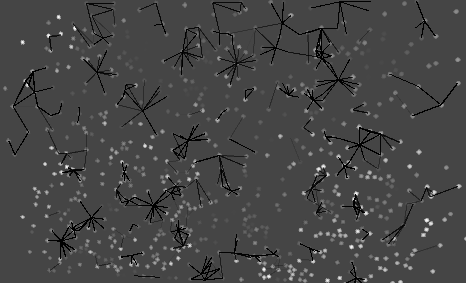

Unstable connections led me to seriously use the debugger to step through the state of my program. I still have to learn that I should use the debugger for most issues and every time I am forced to use it I appreciate the tool more and more.  
I then wanted to also build the experiment for Android. I found the setup of the SDK quite painless by following the [Unity documentation](http://docs.unity3d.com/Manual/android-sdksetup.html). A lot of the development environment is automatically setup for the user too. So building an Android project while a phone is connected will automatically push and launch the build on that device.  
One extraneous feature I personally wanted was getting debug log messages displayed in the Unity editor while running on a phone. I burned a few hours too much on this and later just dropped the issue for a later time.


## Week 04
At the start of week 4 I wanted to make a simple strategy game for my phone. Inspired by games like Swords & Soldiers and older Flash games I played on online portals it was to be a single lane game.  
The concept was that you played as an angry little necromancer sitting in your castle, sending out minions to plunder the neighboring farms. Getting the loot back in your domain would enable you to build more minions. Overextending your raids would cause to farmers to get fed up and retaliate.

I had researched plenty of techniques for running economies in the past. The biggest challenge for this experiment was getting all systems up and running in a short time.  
On the first day I made basic assets in order to have reference points for placing the camera. I then made a simple UI that would work well for mobile phones as well as scale properly with different screens.   

On the second day I made a simple resource system. I researched C# operator overloading in order to come up with a user friendly way of programming transactions. A *loot* item can hold any amount of any *resource*. This way a unit can just add any *loot* it picks up to one *pouch*. A *pouch* then acts the same as a piece of loot, but adding or removing resources from it triggers an event on the holder of the container. This way UI or feedback systems can just ask a unit or building to notify them when something changes instead of having to ping the *pouch* every so often.

The next day I worked on the world units; the buildings, units and interactions (looting) between them. A units' location is a number on a 1 dimensional line and can be used for simple comparisons (are they ahead of me or behind) and colliders would be used for registering hits and attacks.  
I also created a notion of *factions*, so that *units* can ask their *faction* for what their default action against another *unit* should be. For this experiment, I created a **player** faction that's aggressive towards anybody, a **peasant** faction that's scared of the **player** but supports the **royal** faction and a **royal** faction that's aggressive towards the **player** and ignores the **peasant**.  
I found enjoyment in creating a system that would enable simple reasoning for its agents. For example, a **peasant** unit could even modify it's stance against a **player** unit based on how fed up it was with the amount of times this individual was stolen from.  
I then made the units actually move around on the board. But then I ran into a part of the design that took much more time than I had anticipated: the logic for the units. Although simple in theory, I had zero previous experience with implementing AI directly. Because of this I spend the last two days of the week getting the simplest of interactions done.

### Lessons Learned

Android strategy
Made economy
Made factions, with units
Flexible UI
Spend too much time

   
Test subscript

## Week 05
Because of my lack of experience directly working on NPC agents, I had to resort to an ad-hoc solution during last week. So this week I researched common game AI techniques with the goal of creating a basic implementation of one such scheme.  
This [article by Dave Mark, AI Architectures: A Culinary Guide](http://intrinsicalgorithm.com/IAonAI/2012/11/ai-architectures-a-culinary-guide-gdmag-article/), gave a good description of the most common approaches. But [this article by  Chris Simpson, Behavior trees for AI: How they work](http://gamasutra.com/blogs/ChrisSimpson/20140717/221339/Behavior_trees_for_AI_How_they_work.php), was my direct inspiration for what I worked on this week. In it Simpson goes over the use cases for behavior trees, all the tools a behavior tree scheme exposes to a designer and how they fit into your tool belt. It described none of the implementation details for a behavior tree, which left a great exercise for me.  

With Simpson's article for reference I designed and worked on my own implementation of a behavior tree. I had finished 90% of the functionality I was planning on by Tuesday, but it was very hard to debug any logic errors in my implementation by stepping through code with the debugger. And poking around was also starting to be a no-go as I had unwittingly started relying on some C# features that increased in-editor build times. The point of using behavior trees is that they are very tool-friendly, so I resigned myself to creating an in-editor visualization tool.  

I took my first dive into Unity's editor GUI scripting which was surprisingly consistent in it's API compared to other parts of Unity. The editor GUI is scripted in an "immediate mode" paradigm. So instead of creating UI objects and adding callbacks, you write code like ``_newString = GUILayout.TextField(_oldString);`` which results in an inputfield appearing in your editor.       
I started by just drawing a simple tree view of behavior trees. I then added simple recording functions behind some debug toggles in the Node base class. The editor UI could then use this data to highlight specific nodes when they were recently evaluated.  
This editor view would now instantly show when branches of the tree I expected to be evaluated would be skipped. All the time I wasted trying to find what node contained a bug could not be spend fixing said bug.  
Sometimes I found Simpson's article a bit ambiguous. For these moments I used [LibGDX's documentation on their Behavior Tree implementation](https://github.com/libgdx/gdx-ai/wiki/Behavior-Trees) as it contained much more explicit definitions of how certain aggregate nodes should treat their children.  

After finishing all the basic components of my behavior tree, I worked to replicate the rudimentary AI I had made in Week04 using this new system. I designed the logic and created additional types of tree nodes for interacting with the game.  

### Lessons Learned
At the end of the week I had the same identical behavior from a week before. However, the old approach had already arrived at a dead end and was very resistant to modification. Now I had a system that invited change and experimentation. It showed what an agent was "thinking" at all times.  
What I found to be the biggest success, was my productivity. By not worrying about a game and starting with a clear article on how the system I was to build should be used I could just analyze and work within a narrow field.   
I can now say that although it's fun to learn a lot about many unrelated things at the same time, the cost for switching contexts all the time is very high. It's not just waste through adjusting to a different mindset. While I research a topic I build up a backlog of follow-up sources to study next. By switching between too many new topics I also lose the right frame of mind for the follow-up sources, making the learning experience less effective.  
At the end of this week I was happy to have dived into AI. I found enough new ground and concepts within this corner of development that I would like to explore more.  

## Week 06  
I wanted to do more with behavior trees for this week. There were plenty of directions I couldn't travel down last week. First I spend some more time reading articles and watching presentations on AI. A common use for AI is to simulate intelligent squad behavior in action games. I wanted to take a crack at this.  
My goal was to create an environment where the player has to hide from a squad of AI agents. The agents should exchange information and coordinate movement together.  

Before I could start adding things to my behavior tree, there were some issues I needed to resolve in my old approach. I first had to spend time cleaning up my implementation so that it didn't rely on some static references anymore, instead behaviorTrees got a reference to BehaviorTreeManager to replace all this functionality. In retrospect it's similar to dependancy injection. This made it possible to keep track of which tree instances were trying to talk to global objects. Now multiple trees could be visually represented at the same time and even communication between them could be visualized in the future.

Then came my attempts at creating a "squad" brain. My first instinct was to make it possible for tree nodes from a unit to look up it's "squad" in its AI blackboard. However this did not make it possible to create a squad brain. Units were still considering what to do on an individual basis. My changes only made it so that they could look at their squadmates, but not communicate with them. There was still no intelligent "squad mentality".  
After mucking around with my work for a while I did more research and looked how other, smarter, people implemented these things before. I found that the architecture required to support this flexible hive mentality that I wanted to achieve was waaay out of scope for this project.  
So in the end I had to give up. Before the end of the week, I did manage to make the units in my faker squad to use the Unity navmesh to traverse a scene and evaluate distances and proximity to targets. 

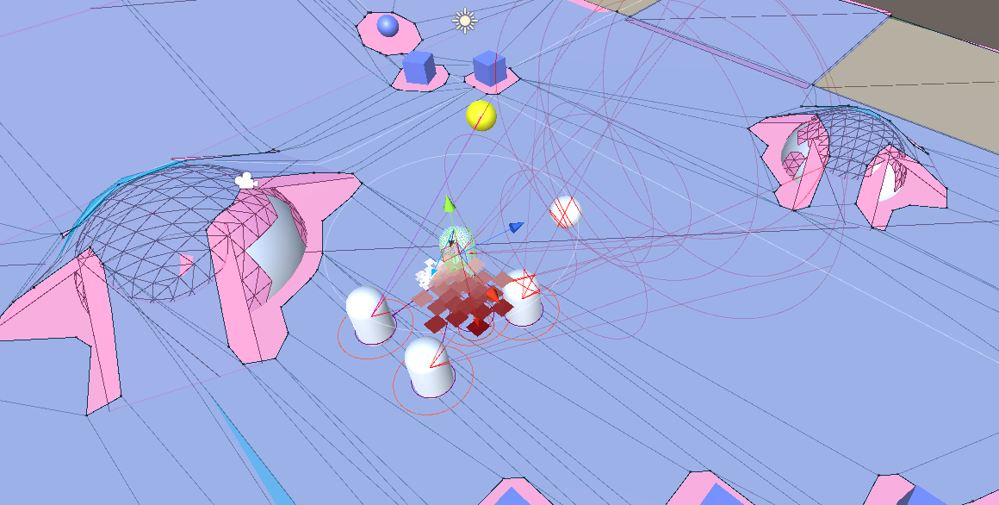

## Week 07/08
I merged these last weeks because these two weeks would both be cut short and I didn't want to reduce the scope of the last experiment. I wanted to make a simple procedural level, after reading [a book written by Derek Yu, designer of the game Spelunky](https://bossfightbooks.com/products/spelunky-by-derek-yu). 

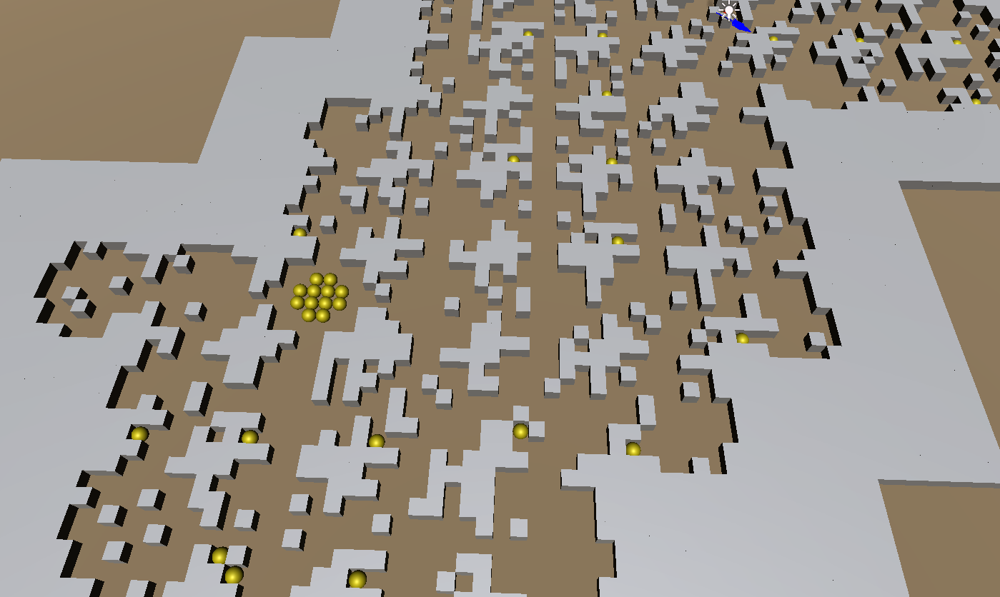

From a zoomed out view you can still see the individual squares. The main take away from Derek Yu's writing was that sometimes (most of the time probably) extremely simple solutions will work great. So for my simple dungeon, I do a drunkard walk (randomly travel in different directions) to determine the start and end of the dungeon, then do a single "thicken" pass over the route where all empty neighbours are made walkable, and finally one more "thicken" pass where I make empty neighbours walkable with a 50/50 chance. This already gives a satisfying layout. For the individual rooms I used very simple hardcoded definitions. I just made static functions like the one below that return a 2D array of shorts.    

```csharp
// Open = O = 0
public const short OPEN = 0;
public const short O = OPEN;

// Solid = S = 1
public const short SOLID = 1;
public const short S = SOLID;

// Random = R = 2
public const short RANDOM = 2;
public const short R = RANDOM;

public const short TREASURE = 10;
public const short T = TREASURE;


public static short[][] EmptyRoom()
{
    return new short[ChunkDimension][]
    {
        new short[ChunkDimension] {O,O,O,O,O,O,O,O},
        new short[ChunkDimension] {O,O,O,O,O,O,O,O},
        new short[ChunkDimension] {O,O,O,O,O,O,O,O},
        new short[ChunkDimension] {O,O,O,O,O,O,O,O},
        new short[ChunkDimension] {O,O,O,O,O,O,O,O},
        new short[ChunkDimension] {O,O,O,O,O,O,O,O},
        new short[ChunkDimension] {O,O,O,O,O,O,O,O},
        new short[ChunkDimension] {O,O,O,O,O,O,O,O}
    };
}

public static short[][] TreasureRoom()
{
    return new short[ChunkDimension][]
    {
        new short[ChunkDimension] {S,S,S,O,O,S,S,S},
        new short[ChunkDimension] {S,O,O,O,O,O,O,S},
        new short[ChunkDimension] {S,O,O,T,T,O,O,S},
        new short[ChunkDimension] {O,O,T,T,T,T,O,O},
        new short[ChunkDimension] {O,O,T,T,T,T,O,O},
        new short[ChunkDimension] {S,O,O,T,T,O,O,S},
        new short[ChunkDimension] {S,O,O,O,O,O,O,S},
        new short[ChunkDimension] {S,S,S,O,O,S,S,S}
    };
}
```
This did not take any time to set up. I don't need to do file IO to load anything, I don't need to design a data format. I just use plain 2D arrays for my simple 2D dungeon. And it works fine!

Next I worked on a simple character controller. I modelled a simple mole character, and rigged it to a simple rig with his belly on a separate bone from his body. This way, it could flop with a delay as the character turned around. Making the movement feel snappy, satisfying and punchy was a nice exercise. Using my improved understanding of physics gained over the previous weeks, I was able to easily plan and implement the kind of reactions I wanted.  
  
I also added simple hack 'n slash like boxing mechanics. The gloves are animated through code, and the hitbox expands completely separate from the visuals. This made it easy to make it feel like your punches would always connect when you would expect them to.   
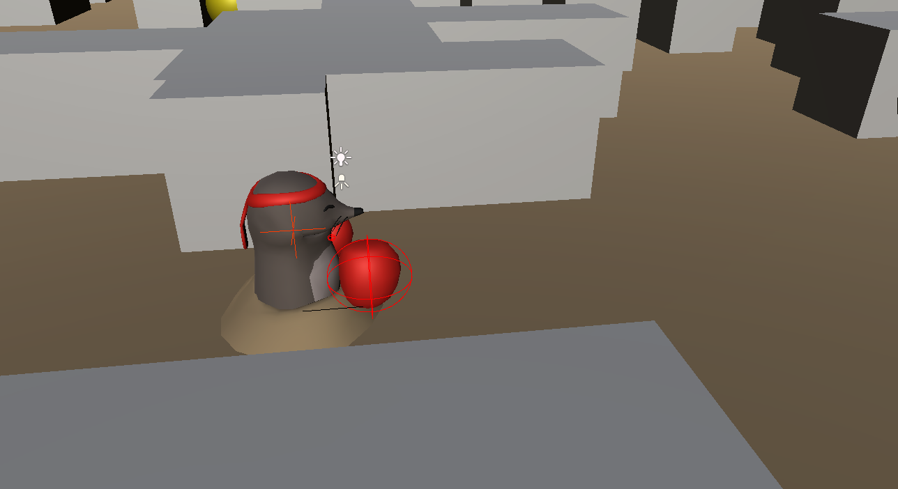  
Next up it was very annoying how the character would often get stuck on corners. What happens is that when the character is touching a wall and you move diagonally towards it, the character won't even move sideways because it can never start gaining momentum, thus never start sliding.

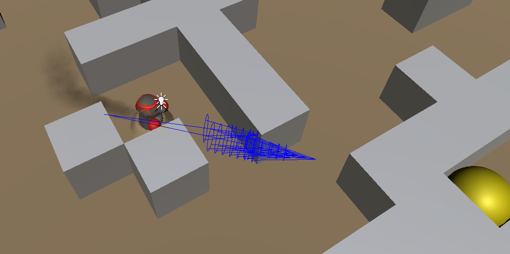  
  

To fix this I implemented avoidance, [based on this article](http://www.gamasutra.com/blogs/MikeBithell/20140420/215842/Automatic_avoidance_for_player_characters_on_an_indie_budget.php). The system uses three "whiskers" to look in the direction the player is pressing on the joystick. If the center whisker is quite touching a wall, and either the left or right whisker is significantly shorter than the other one, the character will try to rotate it's input direction and try again, untill no whiskers are squashed anymore, or rotating didn't really improve the situation. After tuning the width, length and steering strength of this system, the character will easily steer alongside very tight corners. This was very satisfying, because although the final implementation got a bit complex the end result is completely invisible to the player.

### Lessons Learned
Simple design equals a much faster pace of development. This just makes everything more enjoyable to work and iterate on, which is a general lesson learned over this entire project.


## Conclusion
After several weeks of intense experimentation I can safely say I learned a lot about programming and a little bit about myself.
By trying to tackle different subjects than the basics of a game (like standard navigation and UI), I was forced into trying out new programming structures to solve new problems. Between weeks I went back and forth between attempting the simplest possible design and overcooked structure. This grew my appreciation of the consequences of poor design and made me dread the timesink that is overengineering. Over these few weeks my sensibilities and taste for "good code" grew a lot more than during the times I was only using programming as a means to an end. 
I also learned some things about myself. The goal was to chase interesting new subjects to try to tackle every week, but while working on new subjects I sometimes found myself extracting and focusing on an area of the new subject that I was already more comfortably with, like working on toolmaking and designing a workflow while I was meant to work on AI. Even when my goal is to "cut loose" I need to keep an eye on myself to make sure I still maintain focus on my bigger goals.
